# Summary

DiRe - JAX is a new dimensionality reduction toolkit designed to address some of the challenges faced by traditional methods like UMAP and tSNE 
such as loss of global structure and computational efficiency. Built on the JAX framework, DiRe leverages modern hardware acceleration to provide 
an efficient, scalable, and interpretable solution for visualizing complex data structures and for quantitative analysis of lower-dimensional embeddings. 
The toolkit shows considerable promise in preserving both local and global structures within the data as compared to state-of-the-art UMAP and tSNE implementations. 
This makes it suitable for a wide range of applications in machine learning, bioinformatics, and data science.

# Statement of need

Traditional dimensionality reduction techniques such as UMAP and tSNE are widely used for visualizing high-dimensional data in lower-dimensional spaces, 
usually 2D and sometimes 3D. Other uses include dimensionality reduction to other, possibly higher and thus non-visual dimensions, for the subsequent use of classifiers such as SVMs.

However, these methods often struggle with scalability, interpretability, and preservation of global data structures. For example, while fast and scalable, UMAP may overemphasize 
local structures at the expense of global data relationships [@pachter]. And tSNE, while known for producing high-quality visualizations, may be computationally 
expensive and sensitive to hyperparameter tuning [@kobak2019art].

DiRe-JAX addresses these challenges by offering a scalable solution that balances the preservation of both local and global structures. Leveraging the JAX 
framework allows DiRe-JAX to efficiently handle large datasets by utilizing GPU/TPU acceleration, making it significantly faster than CPU-based implementations 
without compromising on the quality of the embeddings.

DiRe-JAX also includes a wealth of metrics for analyzing embedding quality and for hyperparameter tuning. Given its runtime efficiency, tasks such as grid-search 
hyperparameter optimization become feasible even in low-cost environments like Google Colab.

This makes DiRe-JAX an essential toolkit for researchers and practitioners working with complex, high-dimensional data.

# Benchmarks

A few benchmark below provide some visuals regarding the global structure changes or preservation by various methods, such as 

## Dataset: Disk Uniform

+-------------------------------------------------------------------------------------+------------------------------------------------------------------------------------+
| 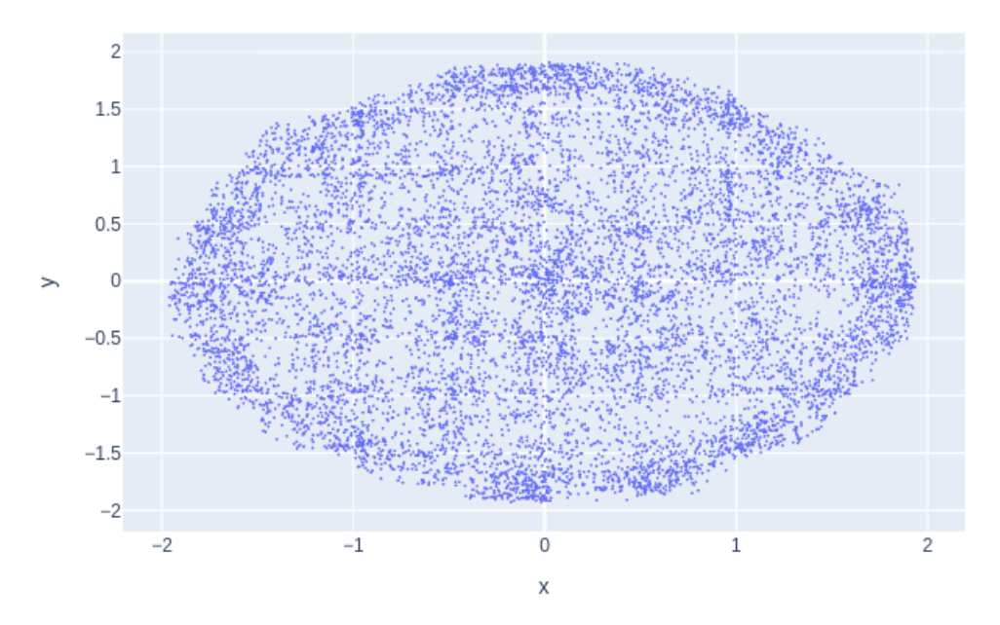{height="80pt"}     | 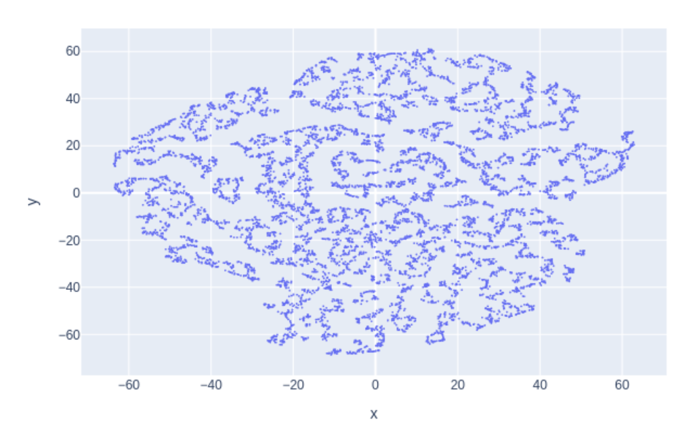{height="80pt"}            |
+-------------------------------------------------------------------------------------+------------------------------------------------------------------------------------+
| 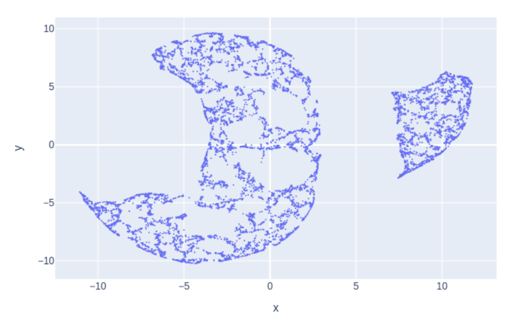{height="80pt"}   | 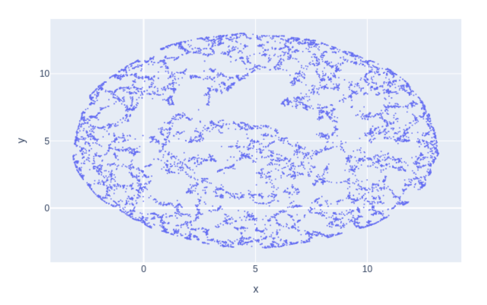{height="80pt"}            |
+-------------------------------------------------------------------------------------+------------------------------------------------------------------------------------+

## Dataset: Two Half–Moons

+-------------------------------------------------------------------------------------+------------------------------------------------------------------------------------+
| 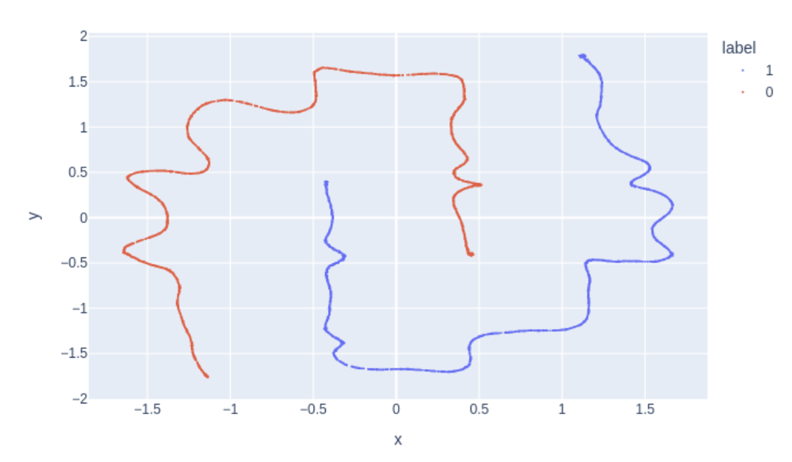{height="80pt"}   | 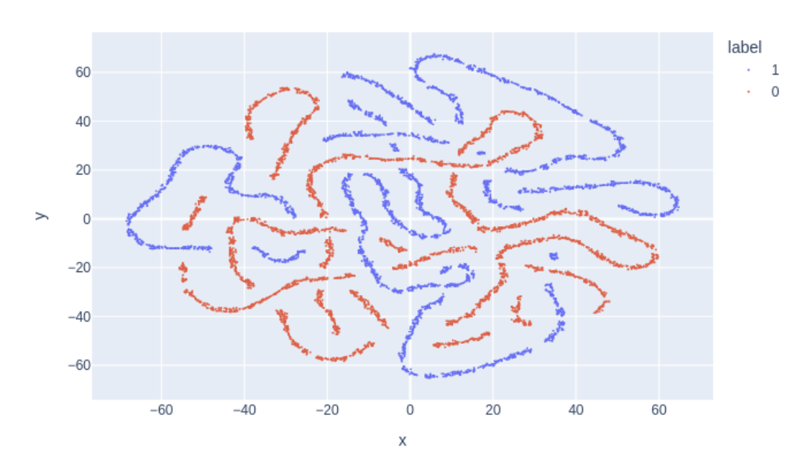{height="80pt"}          |
+-------------------------------------------------------------------------------------+------------------------------------------------------------------------------------+
| 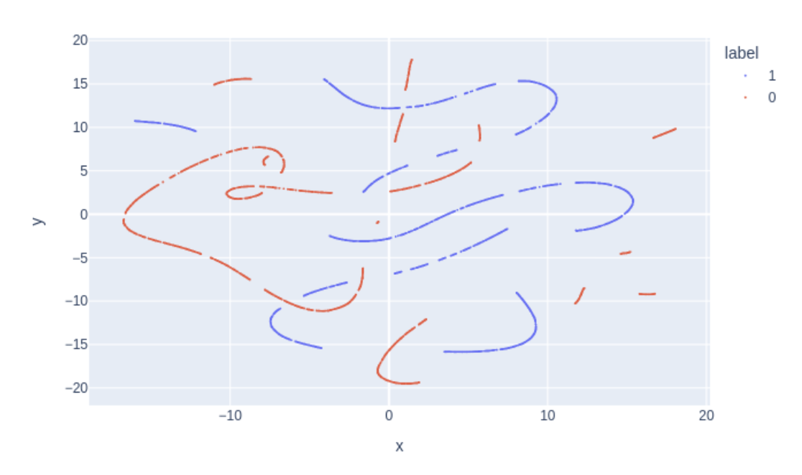{height="80pt"} | 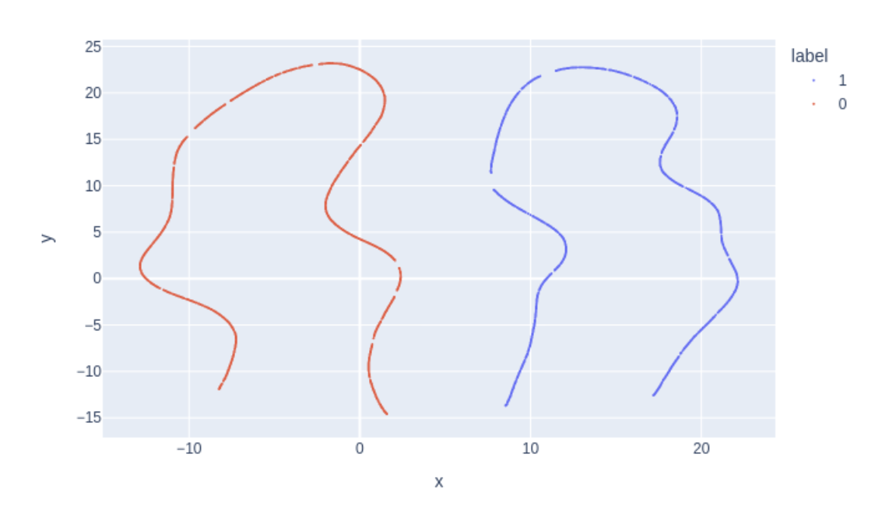{height="80pt"}          |
+-------------------------------------------------------------------------------------+------------------------------------------------------------------------------------+

## Dataset: Levine 32

+--------------------------------------------------------------------------------------------+------------------------------------------------------------------------------------+
| 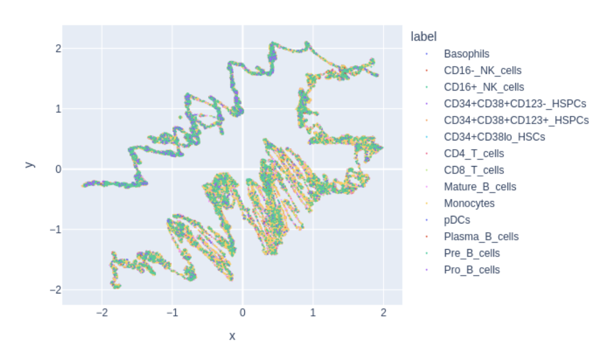{height="80pt"}   | 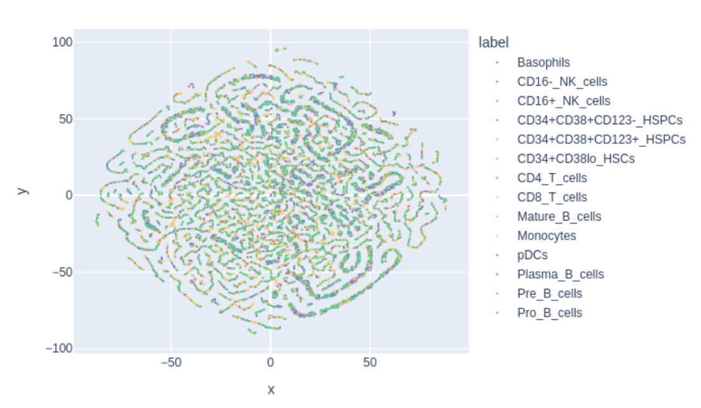{height="80pt"}   |
+--------------------------------------------------------------------------------------------+------------------------------------------------------------------------------------+
| 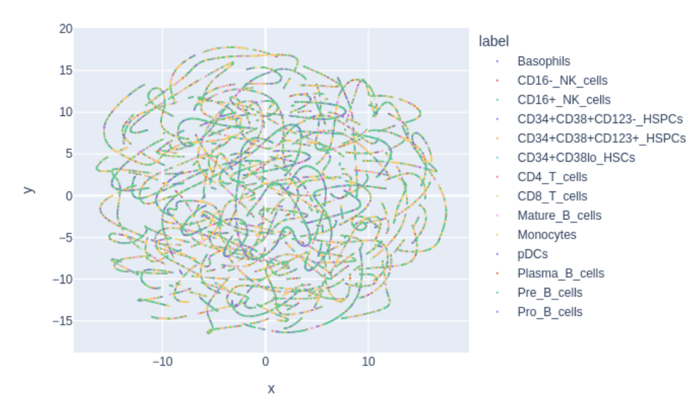{height="80pt"} | 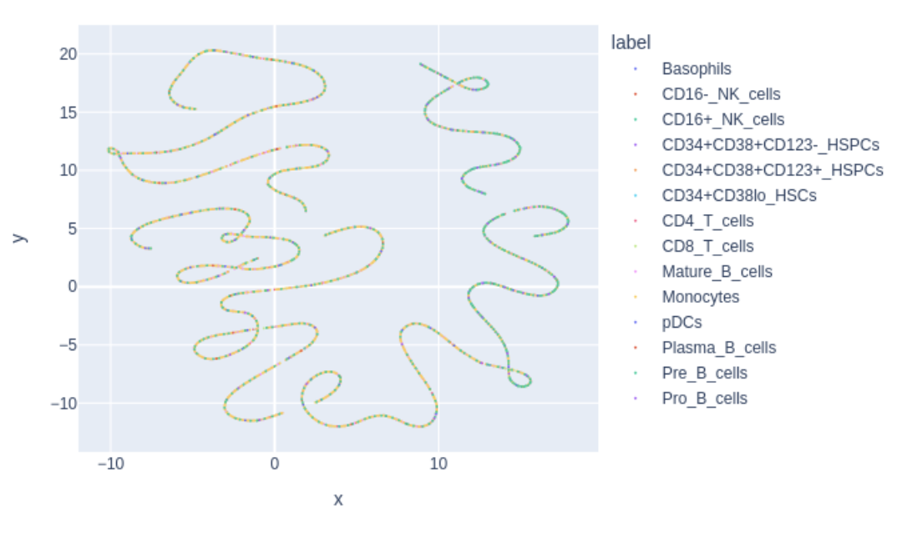{height="80pt"}   |
+--------------------------------------------------------------------------------------------+------------------------------------------------------------------------------------+

# Main methods

The main class of DiRe-JAX is `DiRe`. Let $X \subset \mathbb{R}^n$ be the input data realized as a NumPy array. Then, `DiRe` performs the following main steps:

1. **Capturing dataset topology:** Create the kNN graph of $X$, say $\Gamma$, for a given number of neighbors $k$ (`n_neighbors`) by calling `make_knn_adjacency`. This step uses a JAX kernel specifically developed by the authors to perform the computation on CPU, GPU, or TPU settings. Other libraries like FAISS [@faiss] may also be used, although they do not provide the same hardware universality.
2. **Initial dimension reduction:** Produce $Y \subset \mathbb{R}^d$, the initial embedding of $X$, with $d \ll n$ (usually $d=2$ or $3$) given by the `dimension` parameter, using one of the available embedding methods: `random` (random projections from the Johnson–Lindenstrauss Lemma), `spectral` (using the kNN graph $\Gamma$ to construct the weighted Laplacian, optionally applying a similarity kernel), or `pca` (classical or kernel-based).
3. **Layout optimization:** Call `do_layout` to adjust the lower-dimensional embedding $Y$ to conform to the similarity structure of the higher-dimensional data $X$. This is done via a force-directed layout where the role of “forces” is played by probability kernels (the distributions can be adjusted via parameters `min_dist` and `spread`).

The initial embedding is stored in `self.init_embedding`, while the optimized layout is stored in `self.layout`. Both can be accessed after the main method `fit_transform` is called, for detailed comparison and analysis.

## Random Projection embedding

This embedding is based on the following classical Johnson–Lindenstrauss Lemma [@JL]:

> **Johnson–Lindenstrauss Lemma (Probabilistic Form)**
>
> Given $0 < \epsilon < 1$ and an integer $n$, let $X$ be a set of $n$ points in $\mathbb{R}^d$. For a random linear map $f: \mathbb{R}^d \to \mathbb{R}^k$ where $k = O\left(\frac{\log n}{\epsilon^2}\right)$, with high probability, for all $u, v \in X$:
>
> $$
> (1 - \epsilon) \lVert u - v \rVert^2 \le \lVert f(u) - f(v) \rVert^2 \le (1 + \epsilon) \lVert u - v \rVert^2.
> $$
>
> The value
>
> $$
> \text{dist}(f) = \frac{\lVert f(u) - f(v) \rVert}{\lVert u - v \rVert}
> $$
>
> is called the *distortion* of $f$, and is expected to be close to $1.0$ for a high-quality embedding.

Random projections are simple and computationally inexpensive, but can suffer from cluttered outputs when $k \ll d$ due to variance reduction in the projected data.

## Principal Component Analysis embedding

PCA seeks to preserve as much dataset variance as possible by projecting onto the top $k$ singular vectors. Assume $X$ is column-centered, with covariance matrix $\mathrm{Cov}(X) = \frac{1}{n-1}X^T X$. Compute the singular value decomposition:

$$
X = U \Sigma W^T,
$$

and truncate to the top $k$ singular values $\Sigma_k$ and vectors $W_k$. The rank-$k$ approximation is:

$$
\widehat{X} = U_k \Sigma_k W_k^T,
$$

and the PCA embedding is:

$$
X_k = X W_k.
$$

Under mild conditions on the spectrum, the bottleneck distance between persistence diagrams of $X$ and $X_k$ satisfies [@chazal-persistence]:

$$
d_b(D(X), D(X_k)) \le \lVert \widehat{X} - X \rVert_F = \varepsilon \lVert X \rVert_F.
$$

Thus, PCA approximately preserves topological features up to controlled error.

## Spectral Laplacian embedding

Using the kNN graph $\Gamma$ of $X$, construct the graph Laplacian (optionally with a similarity kernel) and compute the bottom-$k$ eigenvectors for embedding. This method often captures manifold structure but may not preserve global relationships.

## Force-directed layout

After obtaining an initial embedding $Y$, DiRe--JAX applies an iterative force-directed layout to align $Y$’s local structure with that of $X$. Attraction and repulsion forces are modeled after tSNE and UMAP kernels:

$$
\varphi(x) = \frac{1}{1 + a \lVert x \rVert^{2b}},
$$

tuned by `min_dist` $= \delta$ and `spread` $= \sigma$ so that:

- $\varphi(x) \approx 1.0$ for $\lVert x \rVert < \delta$, and
- $\varphi(x) \approx \exp\bigl(-(\lVert x \rVert - \delta)/\sigma\bigr)$ otherwise.

Attraction forces apply to kNN neighbors in $\Gamma$, while all other pairs experience repulsion. Layout iterations run until a preset number of steps is reached.

# Code availability
The DiRe - JAX repository is available on [GitHub](https://github.com/sashakolpakov/dire-jax). An installable package is available on [PyPI](https://pypi.org/project/dire-jax/). 

# Whitepaper
The DiRe - JAX whitepaper is available on the [arXiv](https://arxiv.org/abs/2503.03156) preprint server.

# Acknowledgements
The authors would like to thank [@Treys925](https://github.com/Treys925) (Trey Smith, University of Michigan, Ann Arbor), [@crhea93](https://github.com/crhea93) (Carter Lee Rhea, Université de Montréal), and [@lmcinnes](https://github.com/lmcinnes) (Leland McInnes, Tutte Institute for Mathematics and Computing) for their helpful comments and suggestions. This work is supported by the Google Cloud Research Award number GCP19980904.

# References
